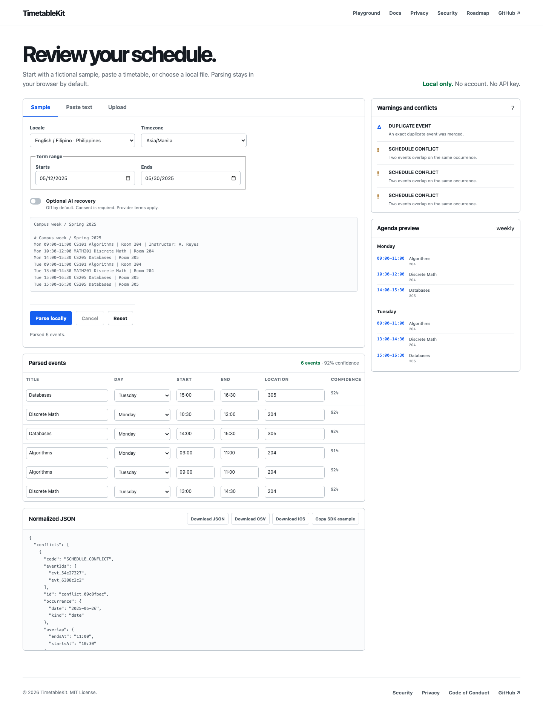

# TimetableKit

TimetableKit is a local-first TypeScript toolkit that turns timetable text, images, and PDFs into validated calendar events.

The v0.1.0 release includes a framework-independent parser, bounded local OCR and PDF adapters, a no-account correction playground, a CLI, and JSON, CSV, and iCalendar exports. The default browser path keeps timetable content in memory and does not require an account or AI key.

## Public API

```ts
import { parseTimetable, toICS } from "@ndycode/timetablekit";

const result = await parseTimetable(
  { kind: "text", text: rawTimetable },
  { locale: "en-PH", timezone: "Asia/Manila" },
);

const calendarFile = toICS(result);
```

Local parsing keeps uploaded content in the browser. Optional remote recovery will require explicit consent and will send only unresolved timetable fields to the selected provider. Files are not persisted by the project.

The package accepts text and CSV directly. The PDF.js and Tesseract adapters add text-PDF, scanned-PDF, and image input without adding those runtimes to the core package.

The companion CLI workspace package is `@ndycode/timetablekit-cli` and exposes the `timetablekit` command. Run `timetablekit parse schedule.txt --format ics --output timetable.ics` after building or installing it.

## Public surfaces

- [Production playground](https://timetablekit.vercel.app/)
- [Preview deployment](https://timetablekit-p18qr1s71-ndycode.vercel.app/)
- [GitHub repository](https://github.com/ndycode/timetablekit)
- [GitHub release v0.1.0](https://github.com/ndycode/timetablekit/releases/tag/v0.1.0)
- [npm package](https://www.npmjs.com/package/@ndycode/timetablekit)

## Try the playground

Open the [production playground](https://timetablekit.vercel.app/playground) and
parse the fictional sample without an account. Edit an event, review warnings,
then download JSON, CSV, or iCalendar output.



## Install from source

The v0.1.0 source is available in the public repository. Run:

```sh
git clone https://github.com/ndycode/timetablekit.git
cd timetablekit
pnpm install
pnpm build
```

Install the published package with:

```sh
npm install @ndycode/timetablekit
```

## Repository map

- [`packages/core`](packages/core) owns schemas, parsing, validation, conflicts, confidence, and exporters.
- [`packages/react`](packages/react) owns reusable correction and preview components.
- [`apps/web`](apps/web) is the public playground and documentation site.
- [`fixtures`](fixtures) contains synthetic, public regression inputs.
- [`docs`](docs) contains architecture, privacy, testing, and release notes.
- [`application`](application) contains dated Vercel program answer drafts and evidence maps.

## Governance

Read [CONTRIBUTING.md](CONTRIBUTING.md), [CODE_OF_CONDUCT.md](CODE_OF_CONDUCT.md), [SECURITY.md](SECURITY.md), [SUPPORT.md](SUPPORT.md), and [GOVERNANCE.md](GOVERNANCE.md) before opening a change.

## Vercel Open Source Program

The playground is configured for Vercel hosting.

[Deploy this repository with Vercel](https://vercel.com/new/clone?repository-url=https%3A%2F%2Fgithub.com%2Fndycode%2Ftimetablekit)

## Status

Release, deployment, package, and integration status are recorded with evidence in [`docs/claims.md`](docs/claims.md). The project does not claim adoption, downloads, stars, users, contributors, or application submission without a directly verifiable source.

TimetableKit is inspired by recurring timetable-import problems seen while building MySched. It is an independent project. No private MySched data is included here.

## License

MIT. See [LICENSE](LICENSE).
